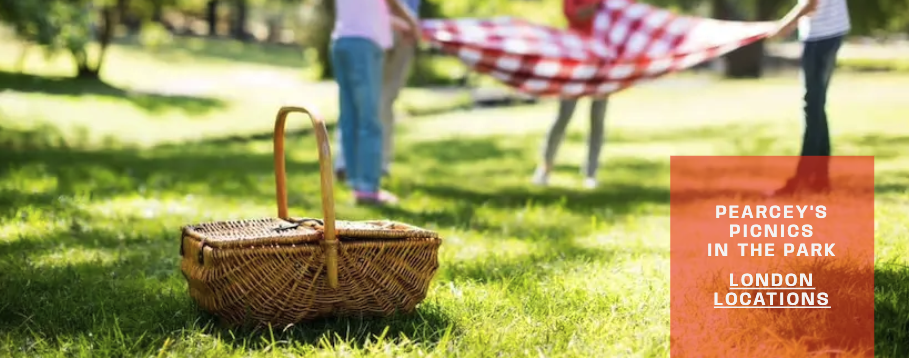
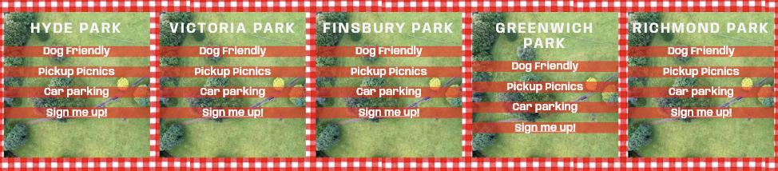
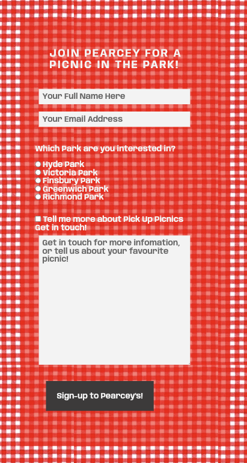

# Pearcey's Picnics

Here is the link to [Pearcey's Picnics](https://bolliebrain.github.io/pearceys-picnics/)

Pearcey's Picnics is a site that advertises picnic based gatherings in London. Pearcey's Picnics sells tickets to attend the event and customers can either bring their own picnic or purchase a pre-ordered picnic to be collected on the day. The site is targeted towards families, groups of people of all ages and backgrounds who wants to experience an alternative festival event in London.

## **Index - Table of Contents**
- User Experience (UX) (complete)
- Features
- Design
- Technologies Used
- Testing
- Deployment
- Credit

## **User Experience (UX)**
- 
- 
- 

## **Features**

### 1. Navigation Bar
- There is a full responsive navigation bar on all three pages, with links to the Home page, Location and Sign Up page and is identical in each page allowing for easy naviation.
- This allows the use to navigate easily around the site from page to page across all devices without having to use the previous page option via the 'back button.

### 2. Landing Page image
- The landing image includes a photograph with a cover text allowing the user to go straight to the locations page where more information is held.
- This section draws the user to the experience that the business offers making it eye catching

### 3. Tagline
- The tagline gives the user an insight into the individuality of the picnic's provided by Pearcey.
- The story provides the user with a background of how the business started with a small family bringing communities together. This provides the user with a welcoming and friendly impression

### 4. Picnic Ideals

- The ideals section allows the user to see what is on offer including the flexibility
- The user will see the value of signing up to learn more about Pearcey's Picnics and finding out what other information is available

### 5. Location Spots

-

### 6. Footer 

-

### 7. Sign-up

-

## Design
- 
## Technologies Used

### Languages Used
- [HTML 5](https://en.wikipedia.org/wiki/HTML5)
- [CSS3](https://en.wikipedia.org/wiki/Cascading_Style_Sheets)

### Frameworks, Libraries & Programes Used
- [Google Fonts:](https://fonts.google.com/) was used to import the 'Anybody' and 'Cursive' fonts into the style.css file which are used on all pages of the project.
- [Font Awesome:](https://fontawesome.com/) was used to add icones for the look and feel as well as UX purposes.
- [Git:](https://www.git-scm.com/) was used for version control by utilising the Gitpod terminal to commit to Git and Push to GitHub.
- [GitHub:](https://github.com/) is used as the repository for the projects code after being pushed to Git.
- [Apple Photos](https://www.apple.com/uk/ios/photos/) was used for resizing images and editing photos for the website.
- [CloudConvert](https://cloudconvert.com/) was used to edit the format for images and convert for easy loading for the website.

## Testing

### Validator Testing

-[HTML Validator](https://validator.w3.org)

- results for index.html

- results for locations.html

- results for signup.html

Full validation results are available on github here :

- reference pdf docs 1 - home. COMPLETE
- reference pdf docs 2 - location. COMPLETE
- reference pdf docs 3 - sign-up. COMPLETE

-[CSS Validator](https://jigsaw.w3.org/css-validator)

- result for styles.css

- The warnings are due to COMPLETE

Full Validation results are available on github here :

- reference pdf doc 1 - css COMPLETE

- Accessability

I can confirm that the colors and fonts chosen are easy to read and accessible by running it through the lighthouse in dev tools

PROVIDE ALL THREE

## Deployment
### How this site was deployed

- 

The live link can be found here - [Pearcey's Picnics](https://bolliebrain.github.io/pearceys-picnics/index.html)

### How to clone the repository
- Go to the https://github.com/bolliebrain/pearceys-picnics repository on Github
- Click the 'Code' button to the right of the screen. click HTTPs and copy the link there
- Open a GitBash terminal and navigate to the directory where you want to locate the clone
- On the command line, type "git clone" then paste in the copied url and press the Enter key to begin the clone process

## Credits

### Code
- Hero Image - Love running
- locations - loosely inspired from love running

### Media
- The icons in the homepage ideals section and footer were taken from [Font Awesome](https://fontawesome.com)
- The fonts were imported from  [Google Fonts](https://fonts.google.com)

All images were downloaded from [Pikwizard](https://pikwizard.com) and [Rawpixel](https://www.rawpixel.com):

- <a href="https://github.com/bolliebrain/pearceys-picnics/blob/main/README.md"> Main hero image photo

- <a href="https://www.rawpixel.com/image/5913129/image-texture-christmas-public-domain"> Ideals, Locations page and Sign up page background image photo

- <a href="https://pikwizard.com/photo/top-view-of-green-grass-field/50a0fe5a40b643cdce910f2d29e9fd31"> Park location background

