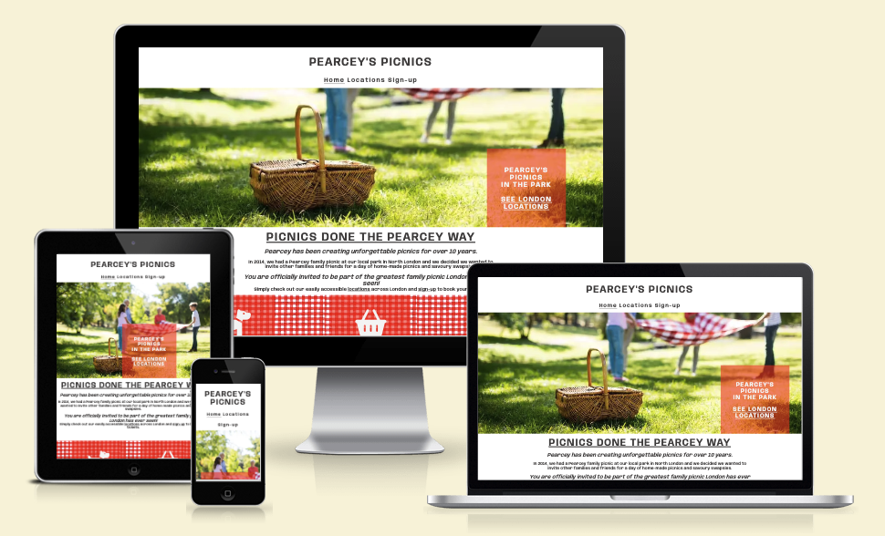
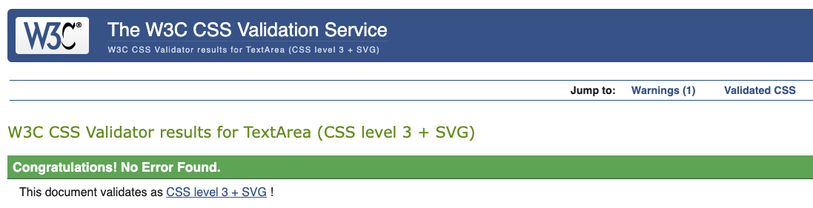

# Pearcey's Picnics

Here is the link to [Pearcey's Picnics](https://bolliebrain.github.io/pearceys-picnics/)

Pearcey's Picnics is a site that advertises picnic based gatherings in London. Pearcey's Picnics sells tickets to attend the event and customers can either bring their own picnic or purchase a pre-ordered picnic to be collected on the day. The site is targeted towards families, groups of people of all ages and backgrounds who wants to experience an alternative event in London.

## **Index - Table of Contents**
- User Experience (UX)
- Features
- Design
- Technologies Used
- Testing
- Deployment
- Credits

## **User Experience (UX)**
First Time Visitor Goals:

- A. As a First Time Visitor I want to understand the main purpose of the site and learn more about the organisation.
- B. As a First Time Visitor I want to be able to navigate through the site easily.
- C. As a First Time Visitor I want to be able to able to find out what aspects are available to me.

Returning Visitor Goals:
- A. As a Returning Visitor, I want to be able to navigate through the site and access content quickly.
- B. As a Returning Visitor, I want to be able to check event locations quickly and easily.
- C. As a Returning Visitor, I want to be able to contact the organisation, ask any questions - or give feedback.

Frequent User Goals
- A. As a Frequent User, I want to be able to sign-up easily for offers available and be kept up to date.

## Features

### **Existing Features**

### 01. Navigation Bar
- There is a full responsive navigation bar on all three pages, with links to the Home page, Location and Sign Up page and is identical in each page allowing for easy naviation.
- This allows the use to navigate easily around the site from page to page across all devices without having to use the previous page option via the 'back button.

### 02. Landing Page image
- The landing image includes a photograph with a cover text allowing the user to go straight to the locations page where more information is held.
- This section draws the user to the experience that the business offers making it eye catching

### 03. Tagline
- The tagline gives the user an insight into the individuality of the picnic's provided by Pearcey.
- The story provides the user with a background of how the business started with a small family bringing communities together. This provides the user with a welcoming and friendly impression

### 04. Picnic Ideals

- The ideals section allows the user to see what is on offer including the flexibility
- The user will see the value of signing up to learn more about Pearcey's Picnics and finding out what other information is available

### 05. Location Spots

- The locations spots allows the user to see what is available at each park and a quick link to sign up.

### 06. Footer 

- The footer is featured on all three pages and is identical on all three pages making it easy to use. It contains two sections:

- Contact us:
The 'Contact Us' section allows the user to send a message or give feedback to the company. This allows an extra option to contact the company without signing up. (As this is a ficticous company, the email address doesnt have a hyperlink)

- Follow us: 
This area has links to social media sites associated with the organisation encouraging the use to keep connected (Facebook, Instrgram, Twitter and Youtube).
The links will open in a new tab to allow easy navigation for the user. The organisation can use these sites to promote brand awareness and keep customers interested through updates, offers, chats and other marketing efforts strategies. (Pearcey's Picnics is a ficticous company, which means the links currently just go to the social media main websites.)

### 07. Sign-up

- The sign-up section allows the user to stay in contact and receive information on the events, buying tickets, other products on offer and any other queries/ feedback they have. The user is asked to provide their full name and email address when signing up. By default, the option to find out more about the Pick Up Picnics is set to 'blank' - to prevent them getting unwanted information in their sign up. 

### 08. Thank You Page
- This page displays a form submission validation which will result in a new tab showing a 'Thank You For Signing Up!' page. The header, navigation and footer remain consistent on this page which will allow the user to be directed back to the home page.

## How these features support the User Stories

- The User Stories in the User Experience (UX) part of this document are numbered and categorised into FT (First Time Visitor), RV (Returning Visitor) and FU (Frequent User). The existing features are listed above as 01-08. Below is the traceability matrix cross-referencing the user stories with the features, illustrating which features support which stories:

## Features which could be implemented in the future

- Further Event information at each location
Having information on other entertainment or products available at each location could increase interest in signing up and potential attendance.

## **Design**
- Color
- Typography
- Wireframes

## **Technologies Used**

### Languages Used
- [HTML 5](https://en.wikipedia.org/wiki/HTML5)
- [CSS3](https://en.wikipedia.org/wiki/Cascading_Style_Sheets)

### Frameworks, Libraries & Programes Used
- [Google Fonts:](https://fonts.google.com/) was used to import the 'Anybody' and 'Cursive' fonts into the style.css file which are used on all pages of the project.
- [Font Awesome:](https://fontawesome.com/) was used to add icones for the look and feel as well as UX purposes.
- [Git:](https://www.git-scm.com/) was used for version control by utilising the Gitpod terminal to commit to Git and Push to GitHub.
- [GitHub:](https://github.com/) is used as the repository for the projects code after being pushed to Git.
- [Apple Photos](https://www.apple.com/uk/ios/photos/) was used for resizing images and editing photos for the website.
- [CloudConvert](https://cloudconvert.com/) was used to edit the format for images and convert for easy loading for the website.

## Testing

### Validator Testing

[HTML Validator](https://validator.w3.org)

- results for index.html

- results for locations.html

- results for signup.html

- results for formsubmitted.html

Full validation results are available on github here :

- <a href="https://github.com/bolliebrain/pearceys-picnics/blob/main/documentation/validation/html-validation-results-index.pdf" target="_blank"> HTML Results - Home Page</a>

- <a href="https://github.com/bolliebrain/pearceys-picnics/blob/main/documentation/validation/html-validation-results-locations.pdf" target="_blank"> HTML Results - Locations Page </a>

- <a href="https://github.com/bolliebrain/pearceys-picnics/blob/main/documentation/validation/html-validation-results-signup.pdf" target="_blank"> HTML Results - Sign up Page </a>

- <a href="https://github.com/bolliebrain/pearceys-picnics/blob/main/documentation/validation/html-validation-thankyou.pdf" target="_blank"> HTML Results - Thank You Page

[CSS Validator](https://jigsaw.w3.org/css-validator)

- result for styles.css

- Import CSS Warning: The warning is with reference to the google fonts link to which the validation test just refers directly to the css document only. This can essentially be disregarded.

Full Validation results are available on github here :

- <a href="https://github.com/bolliebrain/pearceys-picnics/blob/main/documentation/validation/css-validation-stylesheet.pdf" target="blank"> CSS Results - style.css</a>

### Accessibility

I can confirm that the colors and fonts chosen are easy to read and accessible by running it through the lighthouse in dev tools

#### Accessibility Metrics

#### 1. Homepage

#### 2. Locations page

#### 3.Sign-up page

#### 4.Thank You page

### Browser Compatibility

- Testing has been carried out on the following browsers :
- Chrome Version 113.0.5672.126 (Official Build) (arm64)
- Safari Version 16.4 (18615.1.26.110.1)
- Firefox Version 113.0.2 (64-bit)
- Microsoft Edge 113.0.1774.50 (Official build) (64-bit)

### Test Cases and Results

- The below table details the test cases that were used, the results and a cross reference to the Feature ID that each test case exercised (click to open image):

- Code Institute form dump test:

### Known bugs

- Hero image appearing in Microsoft Edge:
I spoke to my mentor about this bug and since then I have been unable to track what fixed it. It could have been due to reducing the pixel size of the image.

## **Deployment**
### How this site was deployed

- In the GitHub repository, navigate to the Settings tab, then choose Pages from the left hand menu
- From the source section drop-down menu, select the Master Branch
- Once the master branch has been selected, the page will be automatically refreshed with a detailed ribbon display to indicate the successful deployment
- Any chnages pushed to the master branch will take effect on the live project

The live link can be found here - [Pearcey's Picnics](https://bolliebrain.github.io/pearceys-picnics/index.html)

### How to clone the repository
- Go to the https://github.com/bolliebrain/pearceys-picnics repository on Github
- Click the 'Code' button to the right of the screen, click HTTPs and copy the link there
- Open a GitBash terminal and navigate to the directory where you want to locate the clone
- On the command line, type "git clone" then paste in the copied url and press the Enter key to begin the clone process

## **Credits**

### Code
- Hero Image - Love running
- locations - loosely inspired from love running

### Media
- The icons in the homepage ideals section and footer were taken from [Font Awesome](https://fontawesome.com)
- The fonts were imported from  [Google Fonts](https://fonts.google.com)

All images were downloaded from [Pikwizard](https://pikwizard.com) and [Rawpixel](https://www.rawpixel.com):

- <a href="https://github.com/bolliebrain/pearceys-picnics/blob/main/README.md"> Main hero image photo

- <a href="https://www.rawpixel.com/image/5913129/image-texture-christmas-public-domain"> Ideals, Locations page and Sign up page background image photo

- <a href="https://pikwizard.com/photo/top-view-of-green-grass-field/50a0fe5a40b643cdce910f2d29e9fd31"> Park location background

